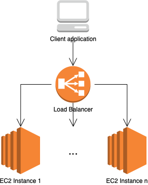

# CrateDB cluster on EC2 instances using Terraform
This Terraform configuration will launch a CrateDB cluster on AWS. It consists of a public-facing load lancer with and a set of EC2 instances.



The provided configuration is meant as an easy way to get started. It is not necessarily production-ready in all aspects, such as backups, high availability, and security. Please clone and extend the configuration to fit your individual needs, if needed.

## Setup
1. Crate a new `main.tf` Terraform configuration, referencing the CrateDB module:

  ```yaml
  module "cratedb-cluster" {
    source = "git@github.com:crate/crate-terraform.git//aws"

    # Global configuration items for naming/tagging resources
    config = {
      project_name = "example-project"
      environment  = "test"
      owner        = "Crate.IO"
      team         = "Customer Engineering"
    }

    # CrateDB-specific configuration
    crate = {
      # Java Heap size in GB available to CrateDB
      heap_size_gb = 2

      cluster_name = "crate-cluster"

      # The number of nodes the cluster will consist of
      cluster_size = 2
    }

    # The disk size in GB to use for CrateDB's data directory
    disk_size_gb = 512

    # The AWS region
    region = "eu-central-1"

    # The VPC to deploy to
    vpc_id = "vpc-1234567"

    # Applicable subnets of the VPC
    subnet_ids = ["subnet-123456", "subnet-123457"]

    # The corresponding availability zones of above subnets
    availability_zones = ["eu-central-1b", "eu-central-1a"]

    # The SSH key pair for EC2 instances
    ssh_keypair = "cratedb-cluster"

    # Enable SSH access to EC2 instances
    ssh_access = true
  }

  output "cratedb" {
    value     = module.cratedb-cluster
    sensitive = true
  }
```

2. Run `terraform init` to download and install all needed providers.

## Execution
To run the Terraform configuration:
1. Run `terraform plan` to validate the planned resource creation
2. Run `terraform apply` to execute the plan
3. Run `terraform output -json` to view the cleartext output, such as the CrateDB URL and login credentials

## Accessing CrateDB
The above last-mentioned step will output all needed information to connect to CrateDB. This includes the publicly accessible URL of the load balancer, as well as login credentials. On opening this URL in a browser, an HTTP Basic Auth appears.

Please note that it might take a couple of minutes before instances are fully provisioned and CrateDB becomes accessible.

## Accessing EC2 instances
Your EC2 instances will only have a public IP address if the corresponding VPC subnet is configured to [auto-assign](https://docs.aws.amazon.com/vpc/latest/userguide/vpc-ip-addressing.html) public IP addresses.

Connecting via SSH can be done using the `ubuntu` user and the configured key pair. In the default configuration, SSH access is enabled in the security group. If can be disabled if needed via the `ssh_access` variable.
