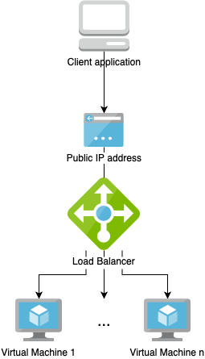

# CrateDB cluster on Azure VM using Terraform
This Terraform configuration will launch a CrateDB cluster on Azure. It consists of a public-facing load lancer with and a set of Virtual Machines.



The provided configuration is meant as an easy way to get started. It is not necessarily production-ready in all aspects, such as backups, high availability, and security. Please clone and extend the configuration to fit your individual needs, if needed.

## Setup
The configuration comes by default with a self-signed SSL certificate. You can deploy your own certificate by passing a custom Java keystore location using the variable `crate.ssl_keystore_filepath`. In this case, also change the `crate.ssl_keystore_password` and `crate.ssl_keystore_key_password` variables for the keystore password and key password accordingly.

To generate your own self-signed certificate, you can use this command:
```bash
keytool -genkey -alias somealias -keyalg RSA -keypass changeit -storepass changeit -keystore keystore.jks -keysize 2048 -validity 1461
```

The main setup consists of the following steps:
1. Crate a new `main.tf` Terraform configuration, referencing the CrateDB module:

  ```yaml
  module "cratedb-cluster" {
    source = "git@github.com:crate/crate-terraform.git//azure"

    # Your Azure Subscription ID
    subscription_id = "your-Azure-subscription-id"

    # Global configuration items
    config = {
      # Used for naming/tagging Azure resources
      project_name = "example-project"
      environment  = "test"
      owner        = "Crate.IO"
      team         = "Customer Engineering"

      # Run "az account list-locations" for a full list
      location = "westeurope"
    }

    # CrateDB-specific configuration
    crate = {
      # Java Heap size in GB available to CrateDB
      heap_size_gb = 2

      cluster_name = "crate-cluster"

      # The number of nodes the cluster will consist of
      cluster_size = 2

      # Default SSL configuration to use the bundled self-signed certificate
      ssl_enable                = true
      ssl_keystore_filepath     = ""
      ssl_keystore_password     = "changeit"
      ssl_keystore_key_password = "changeit"
    }

    # Azure VM specific configuration
    vm = {
      # The size of the disk storing CrateDB's data directory
      disk_size_gb         = 512
      storage_account_type = "Premium_LRS"
      size                 = "Standard_DS12_v2"

      # Enabling SSH access
      ssh_access = true
      # Username to connect via SSH to the nodes
      user = "cratedb-vmadmin"
    }
  }

  output "cratedb" {
    value     = module.cratedb-cluster
    sensitive = true
  }
```

2. Run `terraform init` to download and install all needed providers.

## Execution
To run the Terraform configuration:
1. Run `terraform plan` to validate the planned resource creation
2. Run `terraform apply` to execute the plan
3. Run `terraform output -json` to view the cleartext output, such as the CrateDB URL and login credentials

## Accessing CrateDB
The above last-mentioned step will output all needed information to connect to CrateDB. This includes the publicly accessible URL of the load balancer, as well as login credentials. On opening this URL in a browser, an HTTP Basic Auth appears.

Please note that it might take a couple of minutes before VMs are fully provisioned and CrateDB becomes accessible.

## Accessing Azure VMs
Azure VMs are not directly accessible as they have private IP addresses. To connect to them, use a [bastion host](https://docs.microsoft.com/en-us/azure/bastion/quickstart-host-portal). Please see `terraform output -json` for the user name and private key which are valid for all VMs.
In the default configuration, SSH access is enabled in the network security group. If can be disabled if needed via the `vm.ssh_access` variable.
